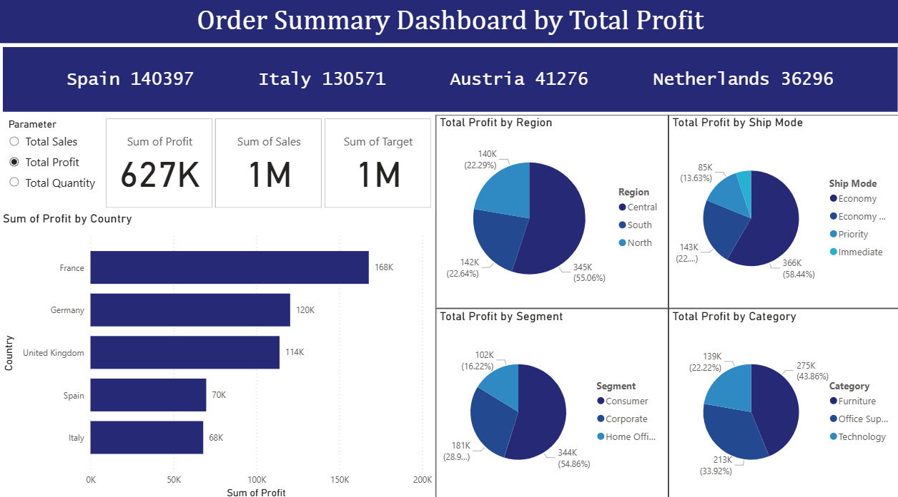

# Power BI Sales Analytics

A Power BI project analyzing sales, profit, and order performance across
European markets using the Superstore and Finance datasets. Covers regional
breakdowns, category analysis, year-on-year growth, and financial dashboarding
with advanced DAX measures and Power Query data modeling.

---

## Dashboard Preview



---

## Key Metrics

| Metric | Value |
|---|---|
| Total Profit | 627K |
| Total Sales | 1M |
| Sales Target | 1M |
| Top Market | France (168K profit) |

---

## What This Project Covers

**Year-on-Year Sales Growth**
DAX measures comparing current year vs prior year sales with growth percentage,
visualized in a line and clustered column chart.

```dax
SalesTY = CALCULATE(SUM(Sales[Sales]), YEAR(Sales[Order Date]) = YEAR(TODAY()))
SalesLY = CALCULATE(SUM(Sales[Sales]), YEAR(Sales[Order Date]) = YEAR(TODAY()) - 1)
Growth%  = DIVIDE([SalesTY] - [SalesLY], [SalesLY], 0)
```

**Order Summary Dashboard**
Interactive dashboard with dynamic parameter switching between Total Sales,
Total Profit, and Total Quantity. Breakdowns by country, region, ship mode,
segment, and product category with cross-filtering enabled.

**Data Modeling - Box Office Dataset**
Multi-year data merged in Power Query into a single master table,
demonstrating append queries and data transformation across sources.

**Category-Wise Waterfall Chart**
Year-on-year performance breakdown by product category showing
incremental gains and losses over time.

**Location Hierarchy Drill-Down**
Country - State - Region - City - Postal Code hierarchy with
hierarchical column chart for location-wise sales exploration.

**Bookmark-Based Date Navigation**
Dynamic filtering by Year, Quarter, and Month using bookmarks
and navigation buttons on the Finance dataset.

**Region Drill-Through**
Donut chart with drill-through functionality enabling detailed
analysis of individual region performance.

**Conditional Formatting Table**
Subcategory-wise table with background color scaling for sales,
arrow icons for profit direction, data bars for quantity,
and font color formatting for discount levels.

**Finance Dashboard**
KPI cards, bar charts, slicers, and navigation bar built
on the Finance dataset for financial performance monitoring.

---

## Files

| File | Description |
|---|---|
| `Powerbi Assignment Submission.pbix` | Main Power BI file with all visuals |
| `Superstore Dataset.xls` | Primary sales dataset |
| `Finance dataset.csv` | Finance dashboard dataset |
| `dashboard.png` | Dashboard screenshot |

---

## How to Open

1. Download and install [Power BI Desktop](https://powerbi.microsoft.com/desktop/)
2. Clone or download this repository
3. Open `Powerbi Assignment Submission.pbix` in Power BI Desktop
4. Datasets are included -- no additional setup required

---

## Tools

`Power BI` `DAX` `Power Query` `Excel` `CSV`

---

## Author

Pavithra Lakshmi Venugopal
M.Sc. Data Science Student, Hochschule Fulda
